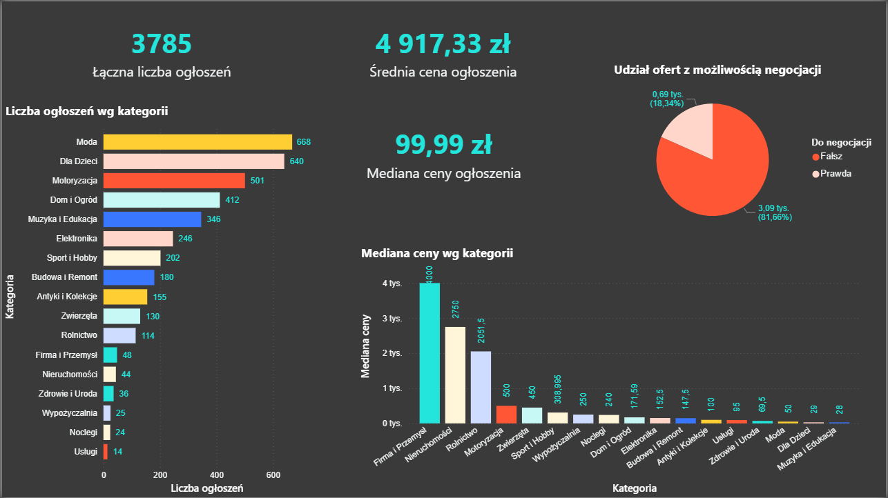

# Analiza ogłoszeń OLX – Web Scraping i Business Intelligence

Projekt przedstawia proces automatycznego pozyskiwania danych z serwisu OLX oraz ich późniejszej analizy z wykorzystaniem narzędzi Business Intelligence.

## Opis projektu

Głównym celem projektu było stworzenie autorskiego scrapera internetowego umożliwiającego pobieranie danych z ogłoszeń dostępnych w serwisie OLX. Następnie pozyskane dane zostały oczyszczone, przekształcone i wykorzystane do budowy interaktywnego raportu w Microsoft Power BI.

---

## Funkcjonalności scrapera

Scraper został napisany w języku Python z wykorzystaniem bibliotek Requests oraz BeautifulSoup.

Dla każdego ogłoszenia pobierane są:

- tytuł ogłoszenia,
- cena (oryginalna i przekształcona do postaci liczbowej),
- informacja o możliwości negocjacji,
- data publikacji,
- pełna ścieżka kategorii,
- hierarchia kategorii (level1–level4),
- województwo,
- miasto,
- dzielnica (jeżeli występuje),
- link do ogłoszenia.

---

## Przygotowanie danych

Po pobraniu danych wykonano proces ETL obejmujący:

- scalanie danych z wielu sesji scrapowania,
- usuwanie rekordów niekompletnych,
- usuwanie ogłoszeń pochodzących z zewnętrznych serwisów (np. Otomoto),
- normalizację cen,
- normalizację dat,
- przygotowanie danych do analizy w Microsoft Power BI.

---

## Analiza danych

Na podstawie przygotowanego zbioru utworzono interaktywny raport Power BI umożliwiający analizę:

- popularności kategorii,
- mediany oraz rozkładu cen,
- udziału ofert z możliwością negocjacji,
- rozmieszczenia ogłoszeń według województw i miast,
- hierarchii kategorii i podkategorii.

---

## Podgląd raportu Power BI

### Kategorie

---

### Analiza cen

---

### Analiza przestrzenna

---

### Hierarchia kategorii

